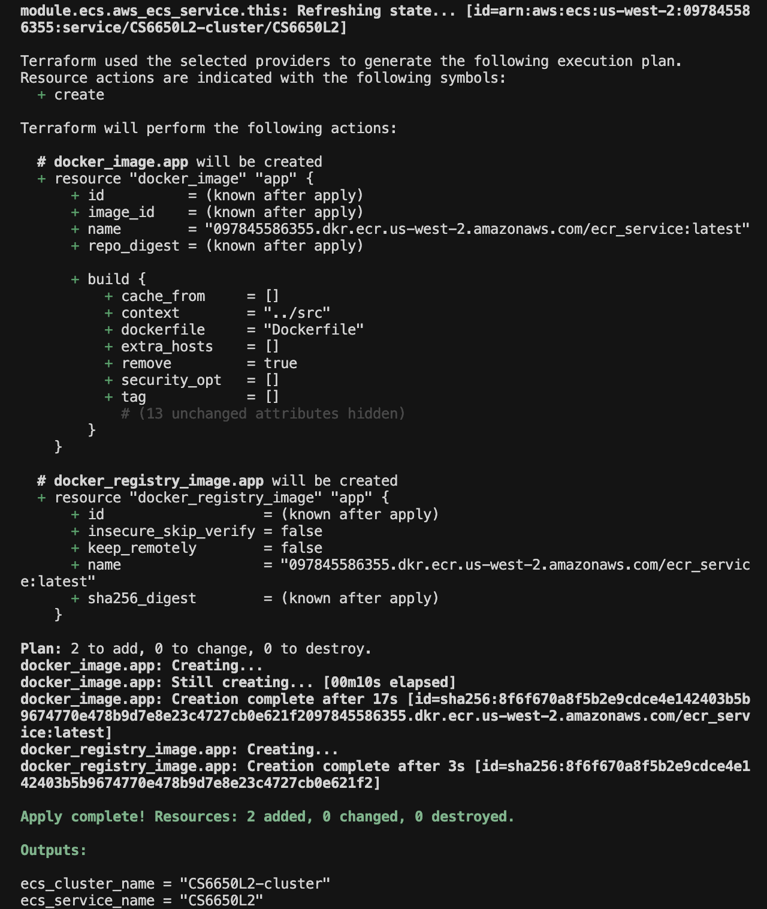
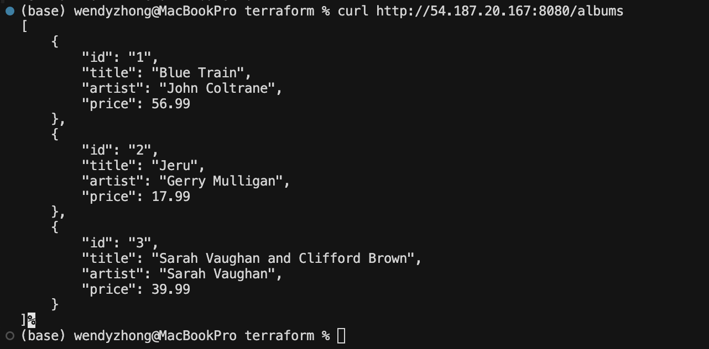

# Troubleshooting and Running Result

---

## Troubleshooting

### Problem Description

When running `terraform apply -auto-approve` to deploy the CS6650 demo (Go app on ECS via Terraform), the following error occurred:

```
Error: Error response from daemon: client version 1.41 is too old. 
Minimum supported API version is 1.44, please upgrade your client to a newer version

  with docker_image.app,
  on main.tf line 41, in resource "docker_image" "app":
```

The failure happened during the creation of the `docker_image.app` resource, when Terraform attempted to build the application Docker image locally.

### Root Cause Analysis

1. **Docker API version mismatch**  
   The Terraform Docker provider (kreuzwerker/docker) bundles its own Go Docker client. In version 2.x, this client defaults to Docker API 1.41.

2. **Updated Docker Desktop**  
   Newer Docker Desktop versions require a minimum API of 1.44. The daemon rejects connections from older API versions.

3. **Environment variable not used**  
   Setting `DOCKER_API_VERSION=1.44` or `1.52` affects only the Docker CLI. The Terraform Docker provider uses its embedded client and does not read this variable.

### Solution

**Step 1:** Upgrade the Docker provider in `terraform/provider.tf` from `~> 2.0` to `~> 3.0`.

**Step 2:** Reinitialize Terraform:
```bash
terraform init -upgrade
```

**Step 3:** Apply again:
```bash
terraform apply -auto-approve
```

The v3 provider uses a newer Docker client that supports API 1.44 and above.

### Additional Notes

- If `terraform init -upgrade` appears to hang, it may be downloading the binary. Wait 2–5 minutes.
- To stop a stuck process: `ps aux | grep terraform`, then `kill -9 <PID>`.

---

## Running Result

The following screenshots show the successful deployment and application response after applying the fix.

**Screenshot 1: `terraform apply` completed successfully**

[]

**Screenshot 2: Application response (`curl` to the ECS service)**

[]
